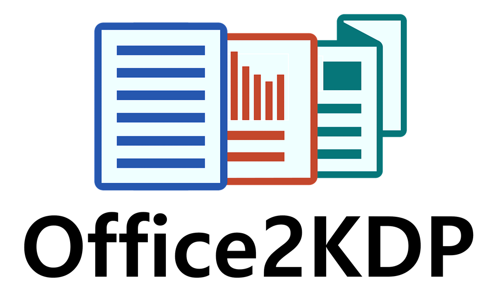

  

# 📦 Office2KDP – Changelog

All notable changes to this project are documented here.  
This project follows [Semantic Versioning](https://semver.org/).

---

## [0.5.0] – 2025-04-15  
### Initial Public Release 🎉

- ✅ Word export macro finalised with:
  - Mirror margins using left/right margin logic
  - Header/footer spacing
  - Section start (Odd, Even, New Page) via dropdown and lookup table
  - Page orientation auto-calculated from trim size
- ✅ Cover generator logic complete:
  - DPI-based pixel output
  - Spine width based on page count and binding type
  - Optional overhang (for hardcover)
  - Bleed settings and rounding logic
- ✅ Settings summary auto-generated inside the exported Word document
- ✅ New Branded logo added to repository
- ✅ `README.md`, `LICENSE`, and `CHANGELOG.md` created

---

## [0.4.0]
### Final Macro Architecture

- 🧠 Introduced `INTERIOR_` and `COVER_` named ranges for clarity
- 🧩 Created robust VBA macro to generate Word templates using named ranges
- ⚙️ Fallbacks and error handling for missing ranges
- 💬 User prompt for file save
- ✅ Word metadata injected (title, author, comments, subject)

---

## [0.3.0]
### Cover & Units Support

- 🎨 Cover dimension calculator finalized:
  - Support for inches, mm, cm, and pixel units
  - Dynamic DPI selection (150, 300, 600 DPI)
  - Cover width = panels + spine + bleed + optional overhang
- 📐 Added named cover presets for binding types (Paperback vs Hardcover)
- 🔁 Pixel rounding logic (round up for pixels, format-only rounding for mm/cm)
- ✅ KDP-compatible layout dimensions matched to official specs

---

## [0.2.0]
### Interior Calculator Enhancements

- 🧮 Margin presets added (Standard, Tight, Spacious)
- 🔁 Trim size selection via dropdown and named table (`Trims`)
- ✍️ Added support for headers, footers, and KDP-safe distances
- 🧾 Created visual preview of layout for Word checklist
- ⚠️ Began distinguishing between MS Word bleed support and print-safe areas

---

## [0.1.0] – 2025-04-03  
### Initial Prototype

- 🚧 Basic Excel trim size calculator created
- 📐 Manual margin calculations for interior files
- 📊 Page count → gutter logic implemented
- 📁 Began supporting both inches and metric units
- 🧰 Explored integration with Word and other MS Office tools

---

📌 Attribution: Developed by [Steve Lownds](https://www.multiplicit.co.uk)  
🛠️ Licensed under [CC BY-NC 4.0](https://creativecommons.org/licenses/by-nc/4.0/)
