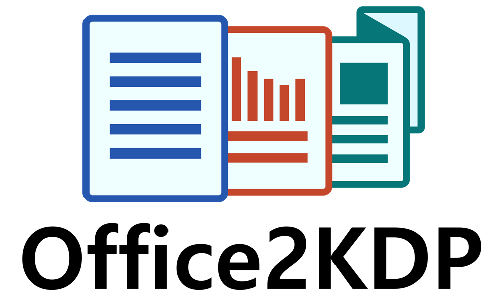

  

# Office2KDP Readme

**Office2KDP** is an Excel-powered publishing toolkit designed for KDP authors and publishers who use Microsoft Office. 
It automates the setup of KDP-ready interior files and book covers using familiar tools like Word, Excel, and PowerPoint — no design software or advanced formatting required.

This tool can act as a calculator to work out dimensions and settings for your own files, or generate ready-to-edit document templates.

---

## ✨ Features

- 📄 **Export Amazon KDP-formatted Word manuscript templates** with perfect margins, headers, and gutter settings
- 📊 **Interactive trim size and margin calculator** powered by named ranges and dropdowns
-  📐 **Cover dimension calculator** based on trim size, spine width, bleed, DPI, and binding
- 📎 **Smart VBA macros** that build a new documents with all the correct layout settings
- 🔒 **CC BY-NC 4.0 license** – can be used to create personal and commercial manuscripts, but this tool itself (or its dreivatives) cannot be sold or commercialised

---

## 🧭 Quick Instructions

1. Open the Excel file and go to the **`Your Document`** tab.
2. Use the dropdowns and input fields to configure your document:
   - Trim size
   - Page count
   - Margins, headers/footers, gutter
   - Cover DPI and bleed settings
   - Output format (Word, PDF, PowerPoint, etc.)
3. Once your settings are complete, visit the appropriate output tab:
   - **`MS Word (.docx)`** – for Word interior layout instructions or export
   - **`MS Word (.pdf)`** – for bleed-safe print layout setup
4. (Optional) Use the built-in button to generate a preformatted Word document using your settings.

Everything updates automatically — no need to adjust formulas.

---
## 📚 Documentation
More information about using and extending Office2KDP can be found in the Github Wiki: https://github.com/multiplicit-com/Office2KDP/wiki

---

## 🚧 Coming Soon

- 🎨 PowerPoint export macro for cover creation (including overhang and bleed support)
- 🖨️ Publisher integration for booklet-style and print-ready export
- 📁 Additional format profiles and file layout options

---

## 📦 What's Included?

- 'Office2KDP.xlsm'  
  The full Excel workbook with:
  - Settings, named ranges, and templates
  - Word export macro (`CreateKDPWordTemplate`)
  - Cover builder and DPI converter
  - Visual overviews for Word layout and cover dimensions

> Please note this workbook is in '.xlsm' format because it contains VBA macros. You may receive security warnings. Please run any security checks you feel appropriate before you open this file, and make sure it comes from the official Github repository. 

---

## 🚀 How to Use

1. Open the Excel file in a macro-enabled version of Microsoft Office (Windows recommended)
2. Choose your trim size, paper type, margins, header/footer settings, and page count
3. Click **Create Word Template** to generate a ready-to-write `.docx` file
4. Customize your content and upload directly to KDP

---

## 🧰 Requirements

- Microsoft Excel + Word (Office 2016 or later recommended)
- Macros must be enabled (VBA-powered)
- Windows OS (macOS may have limited macro support)

---

## 📜 License

This project is licensed under the [Creative Commons Attribution-NonCommercial 4.0 International (CC BY-NC 4.0)](https://creativecommons.org/licenses/by-nc/4.0/).

You may use, modify, and distribute this tool **non-commercially** with proper attribution:

> *"Based on Office2KDP by [Steven Lownds](https://www.multiplicit.co.uk)"*

>  *"Based on Office2KDP by [Multiplicit.co.uk](https://www.multiplicit.co.uk)"*

> *"Based on Office2KDP: [https://github.com/multiplicit-com/Office2KDP/](https://github.com/multiplicit-com/Office2KDP/)"*

Books, manuscripts, and documents **created using this tool** may be used commercially.

---

## 🙌 Author

**Steven Lownds**  
🔗 [https://www.multiplicit.co.uk](https://www.multiplicit.co.uk)  
🔗 [https://www.linkedin.com/in/stevenlownds](https://www.linkedin.com/in/stevenlownds)

---

## 📣 Feedback & Contributions

Have a suggestion, bug report, or want to contribute?  
Open an [issue](https://github.com/yourusername/office2kdp/issues) or submit a pull request.

---

## 💬 Project Status

✅ Word manuscript .docx trim calculator: **Complete**  
✅ Word manuscript .pdf trim calculator: **Complete**  
✅ Word manuscript .docx file generator: **Complete**  
✅ Cover manuscript trim/size calculator, inches, cm, pixels: **Complete**  
🛠️ PowerPoint cover calculator and file generator: **Coming soon**  
🛠️ PowerPoint manuscript caclulator and file generator: **Coming soon**  
🛠️ Publisher cover calculator and file generator: **Coming soon**  
🛠️ Publisher manuscript caclulator and file generator: **Coming soon**  
